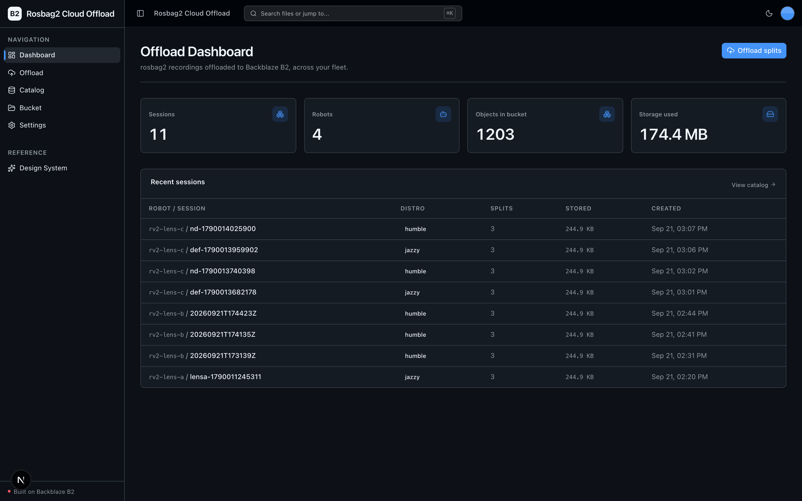
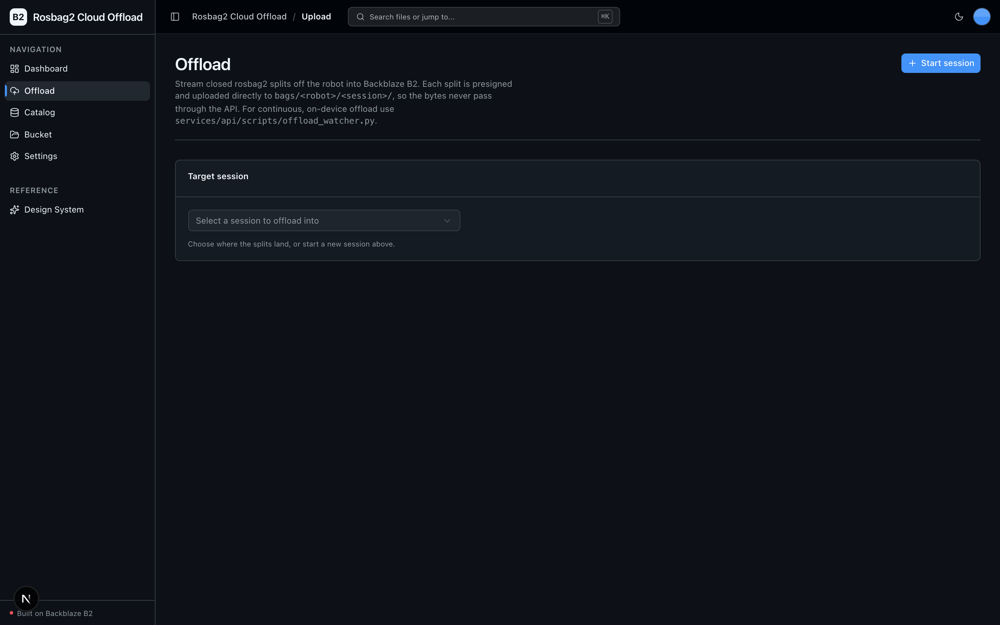
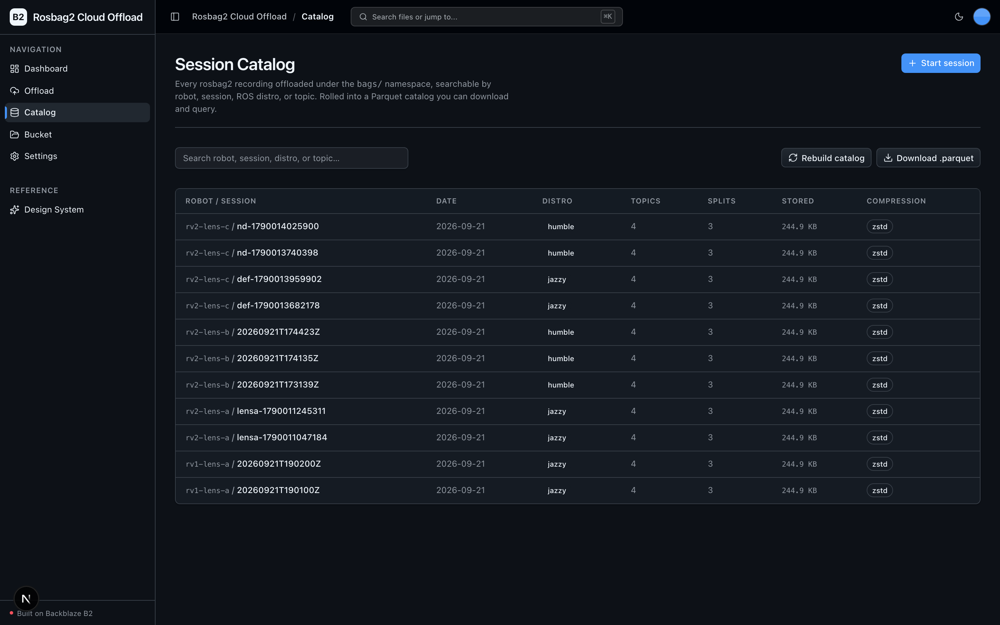
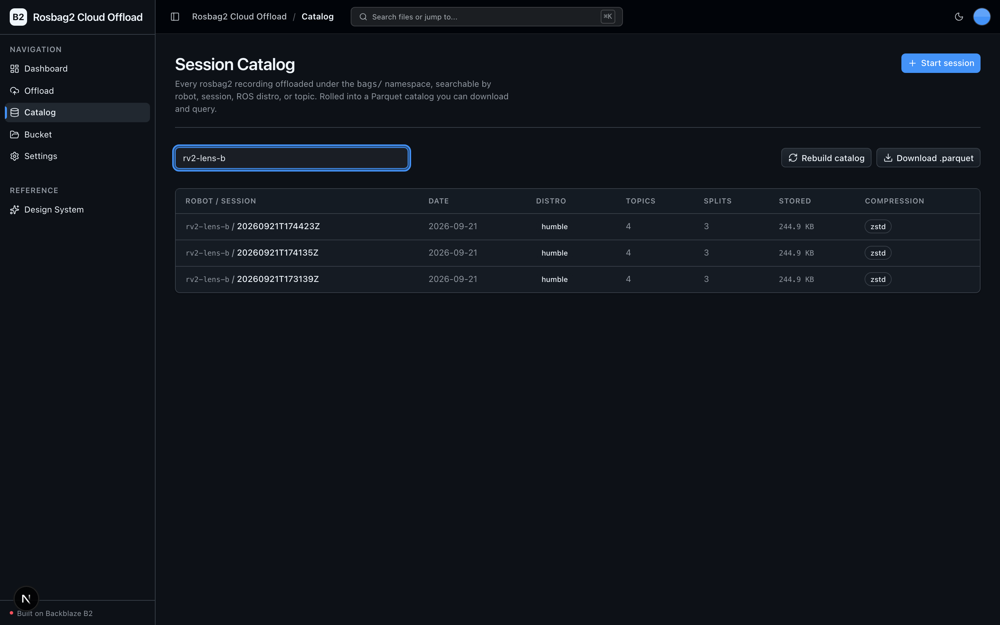
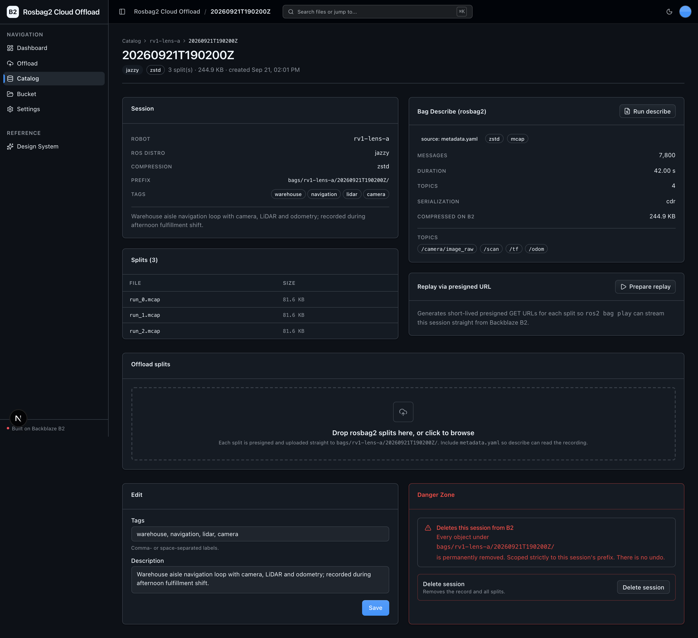

<!-- last_verified: 2026-08-12 -->
<!-- gen:begin readme-header -->
# Rosbag2 Cloud Offload

Continuous rosbag2 offload, describe, and catalog on Backblaze B2 — bags off the robot, searchable and replayable. Stream ROS 2 rosbag2 recordings off the robot into Backblaze B2, describe them from rosbag2's own metadata, and catalog every session in Parquet so any recording can be found and replayed with ros2 bag play from a presigned B2 URL.

Built for developers and AI coding agents: the scaffolding, the storage
wiring and the agent-facing docs are already done, so you start on your
app's own features instead of rebuilding the same shell. Storage is
**[Backblaze B2](https://www.backblaze.com/sign-up/ai-cloud-storage?utm_source=github&utm_medium=referral&utm_campaign=ai_artifacts&utm_content=b2ai-rosbag2-cloud-offload)**, integrated through the S3-compatible API.

**What you get out of the box:**
- Full-stack dashboard UI (Next.js 16 (App Router, React 19, Tailwind v4, shadcn/ui, TanStack Query))
- Continuous Bag Offload — Presigned-PUT each closed rosbag2 split into bags/<robot>/<session>/ while recording continues; local copies deleted only after head_object confirms.
- Session Catalog & Search — Parquet catalog keyed by robot, date, topic set and ROS distro; sample-scoped explorer over the bags/ namespace.
- Bag Describe — ros2 bag info when a ROS 2 env is present, else parse rosbag2 metadata.yaml; writes metadata.json and records compression sizes.
- Replay via Presigned URL — Presigned GET manifest streams a session's splits for ros2 bag play against B2.
- Bucket Explorer — Full-bucket browse across bags/ and catalog/, kept from the starter kit.
- Offload Dashboard — Offload volume, session count, and compression-ratio stats over the bags/ prefix.
- Backend with a strict layered architecture and structural tests (FastAPI (Python 3.12+, boto3, Pydantic v2, pyarrow))
- Agent-optimized docs — your AI coding agent can read the repo and start contributing immediately
<!-- gen:end readme-header -->

<!-- gen:begin readme-screenshots -->
> **Deploy your own in one click** → [Deploy to Vercel](#deploying-to-vercel). One project, one origin, no CORS to wire up.
<!-- gen:end readme-screenshots -->

## What it looks like

**Offload Dashboard** — fleet-wide offload metrics (sessions, robots, objects in bucket, storage used) with a recent-sessions table.



**Offload** — pick a target session and stream closed rosbag2 splits straight into `bags/<robot>/<session>/` on B2.



**Session Catalog** — every offloaded recording under `bags/`, with distro, topic count, split count, size, and compression per session.



**Catalog Search** — filter the catalog by robot, session, ROS distro, or topic.



**Session Detail** — a single session expanded: rosbag2 describe (topics, messages, duration), the split files, presigned-URL replay, and edit/delete controls.



## Quick Start

You need: Node.js >= 20, pnpm >= 10, Python >= 3.12, and a free **[Backblaze B2 account](https://www.backblaze.com/sign-up/ai-cloud-storage?utm_source=github&utm_medium=referral&utm_campaign=ai_artifacts&utm_content=b2ai-rosbag2-cloud-offload)**.

### Start a new project

**Option 1: GitHub Template (recommended)**

Click the green **"Use this template"** button at the top of this repo, name your project, then:

```bash
git clone https://github.com/yourorg/my-cool-app.git
cd my-cool-app
```

**Option 2: Clone and reinitialize**

```bash
git clone https://github.com/backblaze-b2-samples/rosbag2-cloud-offload.git my-cool-app
cd my-cool-app
rm -rf .git
git init
git add .
git commit -m "Initial commit from rosbag2-cloud-offload"
```

Either way you get a clean project with no upstream history — ready to push to your own repo and point your agent at it.

### Setup

**1. Run setup**

```bash
pnpm run setup
```

This copies `.env.example` to `.env` only when `.env` does not already exist,
installs workspace dependencies from `pnpm-lock.yaml`, creates
`services/api/.venv` if missing, validates that an existing venv uses Python
3.12+, and installs the API's committed Python 3.12 resolution from
`services/api/requirements.lock`. It is safe to rerun and never overwrites an
existing `.env`.

> Use the `pnpm run` form: `setup` (like `doctor`) is a built-in pnpm command
> before pnpm 11, so bare `pnpm setup` would run pnpm's own command instead of
> this script.

**2. Add your B2 credentials**

Open `.env` in your editor and keep it visible. Then head to the [Backblaze B2 dashboard](https://secure.backblaze.com/b2_buckets.htm?utm_source=github&utm_medium=referral&utm_campaign=ai_artifacts&utm_content=b2ai-rosbag2-cloud-offload) and:

<!-- gen:begin readme-credentials -->
1. **Create a bucket** and an **application key** with `Read and Write`
   permission, then paste each value into `.env`:
   - `B2_APPLICATION_KEY_ID` — B2 application key id.
   - `B2_APPLICATION_KEY` — B2 application key.
   - `B2_BUCKET_NAME` — Target B2 bucket for bags/ and catalog/.
   - `B2_REGION` — B2 region, e.g. us-east-005; endpoint is derived from it.

   B2 shows an application key once, at creation. The optional variables are
   documented in `.env.example` and in the delivery runbooks.
<!-- gen:end readme-credentials -->

> Want a walkthrough? See the docs for [creating a bucket](https://www.backblaze.com/docs/cloud-storage-create-and-manage-buckets) and [creating app keys](https://www.backblaze.com/docs/cloud-storage-create-and-manage-app-keys).

**3. Run it**

```bash
pnpm dev
```

That's it. Frontend at `localhost:3000`, API at `localhost:8000`. Start a session on the Catalog, offload a rosbag2 split from the Offload page, and watch it land in B2 and appear in the searchable catalog. Interactive API docs (Swagger UI) are at `localhost:8000/docs`, with ReDoc at `/redoc`.

`pnpm dev` runs the preflight check first — it catches the common setup gotchas (wrong Node/Python version, missing venv, missing or placeholder `.env`, ports already taken) and tells you exactly how to fix each one. Run it standalone any time with `pnpm run doctor`.

Want data to look at immediately? `services/api/.venv/bin/python services/api/scripts/seed_demo.py` writes a couple of synthetic sessions — a real rosbag2 `metadata.yaml` plus tiny synthetic splits — to your bucket and rebuilds the catalog, so the Dashboard, Catalog, and Bucket views are populated on first load. It needs no download and no second key.

### Supported local environments

Local scripts run on macOS, Linux, and WSL2 — native Windows isn't supported
yet (the dev scripts use POSIX shell syntax), so use WSL2 on Windows. Cloud or
sandboxed agent environments also need permission to install dependencies and to
bind localhost ports; see
[docs/verification.md](docs/verification.md#local-environments) for the sandbox,
port-fallback, and IPv6 behavior.

## When to use

Use this repository when you run a ROS 2 vehicle or robot program and need
durable, queryable off-machine storage for the bag splits `rosbag2` writes on
every run — without standing up your own object store. It streams each closed
split into Backblaze B2 under `bags/<robot>/<session>/`, describes it from
rosbag2's own metadata, and rolls every session into a searchable Parquet
catalog so any recording can be found and replayed later with `ros2 bag play`
from a presigned B2 URL. It is also a dependable, production-minded sample to
clone and extend: strict layered architecture, contract checks, tests, and
deployment runbooks come with it.

## When not to use

Do not choose this repository expecting a complete hosted fleet-data platform
or a drop-in production service. It does not provide managed hosting, user
accounts, authentication, tenant isolation, billing, retention policy
management, or on-call operations, and it does not run `ros2 bag record` for you
— recording happens on the robot; this app owns everything after a split
closes. Before running an adapted deployment in production, you own its
product-specific security, operations, capacity, compliance, and support
decisions.

## Why Backblaze B2?

[Backblaze B2](https://www.backblaze.com/cloud-storage?utm_source=github&utm_medium=referral&utm_campaign=ai_artifacts&utm_content=b2ai-rosbag2-cloud-offload) is the object storage this kit is built around — a deliberate default, not just a demo backend:

- **S3-compatible API.** B2 speaks the S3 API, so the `boto3` calls, SDKs, and tooling you already use for AWS S3 work unchanged — you just point them at B2's endpoint. This kit uses the S3-compatible API throughout (isolated in `services/api/app/repo/`), so nothing is locked to a proprietary client.
- **Built for data-heavy apps.** B2 storage runs at a fraction of hyperscaler pricing with generous free egress to many CDN and compute partners — what you want when a robot fleet accumulates multi-GB-per-hour bag streams, plus the datasets and artifacts derived from them.
- **Free to start.** A [free B2 account](https://www.backblaze.com/sign-up/ai-cloud-storage?utm_source=github&utm_medium=referral&utm_campaign=ai_artifacts&utm_content=b2ai-rosbag2-cloud-offload) is enough to run everything in this repo.

## Extending this sample

The offload → describe → catalog → replay pipeline is the app; extend it while keeping the shared scaffolding:

- **The vendor engine is rosbag2, and it stays rosbag2.** Describe reads rosbag2's own `metadata.yaml` (and prefers `ros2 bag info` when a ROS 2 environment is on `PATH`) — never a third-party bag reader. Keep it that way when you extend describe.
- **Keep** the UI kit (`apps/web/src/components/ui/` + design tokens in `globals.css` + `/design`) and the full-bucket Explorer at `/files`, which browses everything under `bags/` and `catalog/`.
- **Adapt** the Catalog (`/catalog`) and Dashboard (`/`) to the queries your fleet actually asks — the catalog is keyed by robot, date, topic set, and ROS distro, and the Parquet file is yours to query with DuckDB, pandas, or pyarrow.
- **Rebrand** by editing a single file: `apps/web/src/lib/app-config.ts` (`APP_NAME`, `APP_DESCRIPTION`) updates the page title, sidebar, and breadcrumb everywhere — no other files to touch.

Full contract and rationale: [AGENTS.md §2 — Shared Scaffolding Contract](AGENTS.md#2-shared-scaffolding-contract).

## Agent-First Architecture

This repo is optimized for coding agents. Use the template, point your agent at it, and start building.

The structure follows the principle that **repository knowledge is the system of record**. Anything an agent can't access in-context doesn't exist — so everything it needs to reason about the codebase is versioned, co-located, and discoverable from the repo itself.

### How it works

**[AGENTS.md](AGENTS.md) is the single source of truth for all coding agents.** Its bounded, agent-sized entry point gives agents the repository layout, architectural invariants, commands, conventions, and pointers to deeper docs. Agent-specific files (CLAUDE.md, GEMINI.md, Copilot instructions, etc.) are thin pointers back to AGENTS.md.

**Architecture is enforced mechanically, not by convention.** Layering rules, import boundaries, backend application Python file-size limits, and SDK containment are verified by structural tests and lints that run on every change. When rules are enforceable by code, agents follow them reliably.

**The knowledge base is structured for progressive disclosure:**

```
AGENTS.md              Single source of truth — layout, invariants, commands, conventions
ARCHITECTURE.md        System layout, layering rules, data flows
docs/
  features/            Feature docs (inputs, outputs, flows, edge cases)
  app-workflows.md     User journeys
  dev-workflows.md     Engineering workflows, command index, releases
  verification.md      What each gate checks, and failure recovery
  frontend-conventions.md  Frontend conventions and data fetching
  SECURITY.md          Security principles
  RELIABILITY.md       Reliability expectations
  exec-plans/          Execution plans and tech debt tracker
```

### Key design decisions

| Principle | Implementation |
|-----------|---------------|
| Give agents a single source of truth | AGENTS.md — bounded layout, invariants, commands, conventions |
| Enforce invariants mechanically | Structural tests + ruff + ESLint verify boundaries |
| DRY documentation | Each fact lives in one place; no redundant files to drift |
| Strict layered architecture | `types -> config -> repo -> service -> runtime`, enforced by tests |
| Prefer boring, composable libraries | stdlib logging over frameworks, Pydantic over ad-hoc validation |
| Contain external SDKs | `boto3` only in `repo/` layer — verified by structural test |
| Keep files agent-sized | 300-line limit for backend app Python, enforced by test |
| Docs updated with code | Same-PR requirement prevents documentation rot |
| Structured observability | JSON logging, `/metrics` endpoint, request tracing |

This approach draws from [OpenAI's experience building with Codex](https://openai.com/index/harness-engineering/): agents work best in environments with strict boundaries, predictable structure, and progressive context disclosure.

## Core Features

<!-- gen:begin readme-core-features -->
- [Continuous Bag Offload](docs/features/bag-offload.md) — Presigned-PUT each closed rosbag2 split into bags/<robot>/<session>/ while recording continues; local copies deleted only after head_object confirms.
- [Session Catalog & Search](docs/features/session-catalog.md) — Parquet catalog keyed by robot, date, topic set and ROS distro; sample-scoped explorer over the bags/ namespace.
- [Bag Describe](docs/features/bag-describe.md) — ros2 bag info when a ROS 2 env is present, else parse rosbag2 metadata.yaml; writes metadata.json and records compression sizes.
- [Replay via Presigned URL](docs/features/replay-streaming.md) — Presigned GET manifest streams a session's splits for ros2 bag play against B2.
- [Bucket Explorer](docs/features/bucket-explorer.md) — Full-bucket browse across bags/ and catalog/, kept from the starter kit.
- [Offload Dashboard](docs/features/dashboard.md) — Offload volume, session count, and compression-ratio stats over the bags/ prefix.
<!-- gen:end readme-core-features -->
- [Design System](docs/design-system.md) — tokens, primitives, AI elements, the blaze generating loader, and inline `ErrorState` / `EmptyState` patterns. Live preview at `/design`.
- Inline error handling — fetch failures surface *what's wrong* (API offline, 401, 5xx) and offer a Retry, instead of silently rendering empty state.
- Single-source config — one `.env` at the repo root powers both API and web app, validated at startup so misconfig fails fast with a readable message.
- Centralized data layer — every fetch goes through TanStack Query hooks in `apps/web/src/lib/queries.ts`; cache invalidation is one call after a mutation. The types, route registry and query keys underneath are generated from the API contract by `pnpm gen:api`, so the client cannot drift from the backend.
- Checked local API contract — [`docs/api/openapi.json`](docs/api/openapi.json) plus `pnpm contract:check` catch FastAPI/client route drift; it describes the template API you run, not a hosted public endpoint.
- Structural tests — verify layering rules, import boundaries, SDK containment, and backend application Python file-size limits
- Structured JSON logging — every request traced with `request_id` and timing
- `/health` endpoint — B2 connectivity check
- `/metrics` endpoint — Prometheus-format counters (request count, latency, uploads)
- `/docs` + `/redoc` — auto-generated interactive API docs (toggle off in prod with `ENABLE_DOCS=false`)
- Per-IP rate limiting and magic-byte upload validation — see [SECURITY.md](docs/SECURITY.md)

## Tech Stack

- TypeScript, Next.js 16, React 19, Tailwind v4, shadcn/ui
- TanStack Query — caching, dedup, retry, stale-while-revalidate for every fetch
- Python 3.12+, FastAPI, boto3, Pydantic v2, pyarrow (Parquet catalog)
- rosbag2 as the describe engine — `ros2 bag info` when a ROS 2 env is present, else rosbag2's own `metadata.yaml`
- Backblaze B2 (S3-compatible object storage)
- pnpm workspaces (monorepo)

## Commands

The commands you reach for day to day:

<!-- gen:begin readme-commands -->
| Command | What it does |
| --- | --- |
| `pnpm run setup` | One-time cold start: copy `.env.example` → `.env` (only if missing), install workspace deps, create the backend venv, install locked API deps |
| `pnpm dev` | Start frontend + backend (runs the `pnpm run doctor` preflight first) |
| `pnpm wait-ready` | Block until the running web + API answer, print one line, exit 0/1 — use instead of sleeping before driving the app |
| `pnpm contract:export` | Export the FastAPI OpenAPI contract into `docs/api/openapi.json` |
| `pnpm contract:check` | Verify the exported contract and the generated client routes agree, both ways |
| `pnpm gen:api` | Regenerate the shared types, the client route registry and the query-key factory from the exported contract |
| `pnpm gen:docs` | Regenerate the marker-delimited doc regions from `docs/exec-plans/sample.json` |
| `pnpm gen:check` | Fail if any generated file or doc region is stale (first step of `pnpm verify:web`) |
| `pnpm verify` | Credential-free pre-PR suite — runs `check:agent-docs`, `verify:api`, then `verify:web` |
| `pnpm verify:full` | `pnpm verify` plus Playwright E2E; needs a live local stack, real `.env`, a free web port, and Chromium |
| `pnpm test:verify` | Run throwaway verification specs from `apps/web/e2e/verify/` against the app, with the shared browser fixtures |
<!-- gen:end readme-commands -->

`pnpm verify` is the gate to run before opening a PR. It needs
`services/api/.venv` from `pnpm run setup`, but no B2 credentials or browser, and
it breaks down into `pnpm verify:api` (backend lint, tests, structure),
`pnpm verify:web` (frontend lint, unit tests, typecheck + build), and
`pnpm check:agent-docs` (agent-doc drift).

For the full command reference (`dev:web`, `dev:api`, `lint`, `test:*`,
`check:structure`, `test:e2e`, live B2 tests), see
[docs/dev-workflows.md](docs/dev-workflows.md#commands). For worktree/parallel-run
notes, port-fallback behavior, and slow-run recovery, see
[docs/verification.md](docs/verification.md).

## Deploying to Vercel

Deploys as **one Vercel project** — the Next.js web app and FastAPI API build
from the same repo and share one origin (web at `/`, API under `/api`), so
there's **no CORS and no second URL to wire up**.

<!-- gen:begin readme-deploy-button -->
[](https://vercel.com/new/clone?repository-url=https%3A%2F%2Fgithub.com%2Fbackblaze-b2-samples%2Frosbag2-cloud-offload&project-name=rosbag2-cloud-offload&repository-name=rosbag2-cloud-offload&demo-title=Rosbag2%20Cloud%20Offload&demo-description=Stream%20ROS%202%20rosbag2%20recordings%20off%20the%20robot%20into%20Backblaze%20B2%2C%20describe%20them%20from%20rosbag2's%20own%20metadata%2C%20and%20catalog%20every%20session%20in%20Parquet%20so%20any%20recording%20can%20be%20found%20and%20replayed%20with%20ros2%20bag%20play%20from%20a%20presigned%20B2%20URL.&env=B2_APPLICATION_KEY_ID%2CB2_APPLICATION_KEY%2CB2_BUCKET_NAME%2CB2_REGION&envDescription=B2%20credentials%20and%20bucket&envLink=https%3A%2F%2Fgithub.com%2Fbackblaze-b2-samples%2Frosbag2-cloud-offload%2Fblob%2Fmain%2Finfra%2Fvercel%2FREADME.md)
<!-- gen:end readme-deploy-button -->

Set your B2 credentials and bucket, and you're live. Uploads go **directly from
the browser to B2** (presigned PUT), so Vercel's 4.5 MB payload limit doesn't
apply — you keep the 100 MB default. Two things to know before a real deploy:

- Your bucket's CORS must allow the deploy origin.
- The deployed API is unauthenticated and bucket-wide — use a dedicated B2
  bucket/prefix and key for any preview.

Full setup — variable reference, the two-Projects alternative, security,
preview/production, `/health` checks, and rollback — is in the
[Vercel delivery contract](infra/vercel/README.md).

## Documentation Map

<!-- gen:begin readme-doc-map -->
| Doc | Purpose |
| --- | --- |
| [AGENTS.md](AGENTS.md) | Agent table of contents — start here |
| [ARCHITECTURE.md](ARCHITECTURE.md) | System layout, layering, data flows |
| [docs/features/](docs/features/) | Feature docs (continuous bag offload, session catalog & search, bag describe, replay via presigned url, bucket explorer, offload dashboard) |
| [docs/design-system.md](docs/design-system.md) | Design tokens, primitives, loader, error/empty states |
| [docs/app-workflows.md](docs/app-workflows.md) | User journeys |
| [docs/dev-workflows.md](docs/dev-workflows.md) | Engineering workflows, command index, releases |
| [docs/verification.md](docs/verification.md) | What each gate checks, and failure recovery |
| [docs/frontend-conventions.md](docs/frontend-conventions.md) | Frontend conventions, screens, data fetching |
| [docs/SECURITY.md](docs/SECURITY.md) | Security principles |
| [docs/RELIABILITY.md](docs/RELIABILITY.md) | Reliability expectations |
| [docs/api/openapi.json](docs/api/openapi.json) | The checked-in API contract the client seam is generated from |
| [infra/vercel/README.md](infra/vercel/README.md) | Vercel deployment contract |
| [infra/railway/README.md](infra/railway/README.md) | Railway delivery contract |
| [docs/exec-plans/](docs/exec-plans/) | Execution plans, tech debt, and the sample manifest |
<!-- gen:end readme-doc-map -->

## FAQ

**What is Rosbag2 Cloud Offload?**
An open-source, full-stack sample (Next.js 16 + FastAPI) that streams the bag splits a ROS 2 robot's `rosbag2` writes off the machine into [Backblaze B2](https://www.backblaze.com/cloud-storage?utm_source=github&utm_medium=referral&utm_campaign=ai_artifacts&utm_content=b2ai-rosbag2-cloud-offload) under `bags/<robot>/<session>/`, describes each recording from rosbag2's own metadata, and rolls every session into a searchable Parquet catalog so it can be found and replayed with `ros2 bag play` from a presigned B2 URL.

**Do I need ROS 2 installed to run it?**
No. Describe prefers the real `ros2 bag info` CLI when a ROS 2 environment is on `PATH` (the on-device watcher path), but on the server it falls back to parsing the `metadata.yaml` rosbag2 writes beside every bag — so the app runs, offloads, catalogs, and serves replay URLs without a ROS 2 install. It never uses a third-party bag reader.

**Is it free?**
Yes. The code is MIT-licensed (see [License](#license)), and Backblaze B2 offers a free account to get started.

**Can I use it in production?**
It's a sample Backblaze maintains to help developers store ROS 2 data on B2. Production use is possible with caution and requires your own validation — you own the product-specific security, operations, capacity, compliance, and support decisions for anything you adapt, and the repository software carries no SLA. See [When not to use](#when-not-to-use) and [Maintenance and support](#maintenance-and-support).

**Does it include authentication, user accounts, or multi-tenant isolation?**
No. It does not provide managed hosting, user accounts, authentication, tenant isolation, billing, or on-call operations. The API is unauthenticated and bucket-wide — add whatever your fleet requires on top of the scaffold.

**Do I have to use Backblaze B2?**
It integrates Backblaze B2 through the S3-compatible API, using the standard `B2_*` env vars and a custom user agent, with no second API key. You supply your own B2 bucket and application key during setup.

**How does the offload flow avoid payload limits on big bags?**
Each closed split is uploaded with a presigned PUT straight from the robot or browser to B2 — the bytes never traverse the API Function, so there is no serverless payload ceiling. The on-device `services/api/scripts/offload_watcher.py` deletes the local copy only after B2 confirms the object landed.

**What's the tech stack?**
Frontend: TypeScript, Next.js 16, React 19, Tailwind v4, shadcn/ui, TanStack Query. Backend: Python 3.12+, FastAPI, boto3, Pydantic v2, pyarrow. Storage: Backblaze B2 (S3-compatible). See [Tech Stack](#tech-stack).

**How do I rebrand it for my own app?**
Edit a single file — `apps/web/src/lib/app-config.ts` (`APP_NAME`, `APP_DESCRIPTION`) — and the page title, sidebar, and breadcrumb update everywhere. See [Extending this sample](#extending-this-sample).

**How do I deploy it?**
It deploys to Vercel as a single project — the web app and FastAPI API build from the same repo and share one origin (web at `/`, API under `/api`), so there's no CORS or second URL to wire up. A Railway path is also documented. Deploying is always a human-approved action — see [Deploying to Vercel](#deploying-to-vercel).

**Does it work on Windows?**
Local scripts are supported on macOS, Linux, and WSL2. Native Windows is not supported yet — use WSL2 on Windows.

**Where do I get help or report bugs?**
Report repository defects and feature requests through [GitHub Issues](https://github.com/backblaze-b2-samples/rosbag2-cloud-offload/issues). For B2 account, billing, service, or API help, use [Backblaze Support](https://www.backblaze.com/help).

## Maintenance and support

Backblaze maintains this open-source template/sample to help developers get
started with B2. Production use is possible with caution and requires your own
validation. Report repository defects and feature requests through
[GitHub Issues](https://github.com/backblaze-b2-samples/rosbag2-cloud-offload/issues);
for B2 account, billing, service, or API help, use
[Backblaze Support](https://www.backblaze.com/help). This template/sample is
not covered by the Backblaze service level agreement, and no SLA is provided
for the repository software; any B2 service or support commitments are governed
separately by the applicable Backblaze terms and support plan.

## Contributing

Start with [AGENTS.md](AGENTS.md). It's the map — everything else is discoverable from there. For local commit hooks, follow [the pre-commit workflow](docs/verification.md#pre-commit).

## License

MIT License - see [LICENSE](LICENSE) for details.

## Related projects

**Claude Agent B2 Skill** — manage Backblaze B2 from your terminal using natural language (list/search, audits, stale or large file detection, security checks, safe cleanup). Repo: [claude-skill-b2-cloud-storage](https://github.com/backblaze-b2-samples/claude-skill-b2-cloud-storage).
